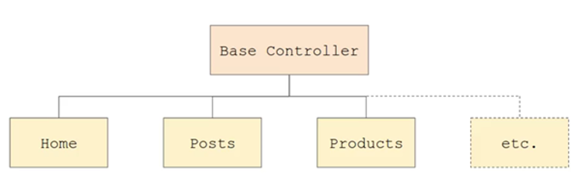
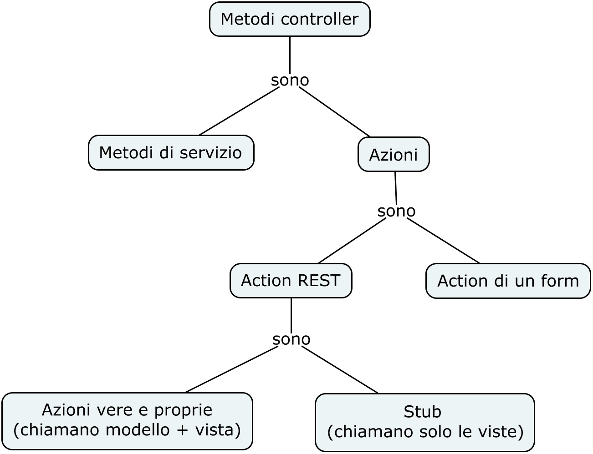

>[Torna a MVC](mvcindex.md) 

## **Controller**

Un controller è un collettore di metodi ai quali corrispondono altrettante invocazioni via HTTP realizzabili mediante un client. Ogni qual volta arriva una richiesta http questa viene esaminata (fase di store) e inoltrata verso il metodo di un certo controller (fase di **dispaching**). Il comportamento adesso descritto è quello tipico di un router. La **direzione** dell’inoltro **è comandata** dalla lettura di un indirizzo di livello applicativo che consiste in una **porzione specifica del path** della risorsa richiesta che d’ora in poi chiameremo **prefisso di routing**:**```../nome_controller/nome_azione/```** dove con i puntini indichiamo, per semplicità, la parte dell’url prima del prefisso di routing, cioè **il percorso del progetto**.  In base al **prefisso di routing**, stabilito nella tabella delle **rotte**, viene scelto il **metodo** di quell’
**controller** che dovrà gestire la richiesta. 

 
 
Il **framework** che adoperiamo non fa differenza tra i vari metodi http (GET,PUT,POST,DELETE) dato che sono trattati tuti allo stesso modo e possono essere mappati su un qualunque metodo di un qualsiasi controller. 
La **differenza** tra i vari metodi è concentrata nei parametri delle richieste che, in un caso o nell’altro, devono essere recuperati da **array associativi globali** diversi. 

Ad esempio, per **recuperare**, all’interno di un **metodo** del controller, un **parametro POST**, si adopera la **variabile globale** php:

```PHP
$_POST["nomeParametro1"]
```

mentre, per recuperare all’interno di un metodo **un parametro GET**, si adopera: 

```PHP
$_GET["nomeParametro1"]
```

**Oggetti del controller**

Un controller è un oggetto che **è instanziato** al momento dell'**arrivo di una richiesta** HTTP ed è l'istanza di una **classe** che deriva dalla classe base **Controller** posta dentro la cartella **Core**. Le **classi derivate** si definiscono dentro la cartella **Controller** in **App**.




I **metodi del controller** si dividono intanto in due categorie: 
- **Metodi di servizio**. Sono metodi che raggruppano alcune operazioni utilizzate da più azioni e che quindi è conveniente tenere a parte per poterle riutilizzare all’interno del codice di più action (azioni).
- **Azioni**. Un’azione è il metodo di un controller che è richiamato dal dispatcher (router) quando questo trova una corrispondenza tra quel metodo e una rotta all’interno della tabella delle rotte. Le azioni, in questo framework devono avere il nome che termina col suffisso Action. Ad es. pizzeAction() è il metodo del controller Prenotazioni ed è invocato, ad esempio, quando il dispatcher riconosce il prefisso di routing www.labottegadimario.com/delivery/prenotazioni/pizze/. 

Le **query string**, cioè la parte dell’url dopo ? non partecipano al processo di routing e vengono rimosse prima che questo venga effettuato. I **parametri** contenuti nelle query string sono comunque accessibili con le apposite **variabili globali** fornite dal PHP e sono utilizzabili in **qualunque metodo** di un controller. 
 


Esistono delle **convenzioni** per i nomi di **classi e metodi**:
-	Il nome di una **classe** in PHP va indicato sempre in **forma maiuscolata** (capitalized) cioè inizia sempre e comunque con una maiuscola. Se il nome è composto, ogni sua parte inizia sempre, a sua volta, con una maiuscola (convenzione **Studly Caps**). 
-	Il nome di un **metodo** di una classe in PHP va sempre indicato in minuscolo se singolo. Se però il metodo ha un nome composto (doppio, triplo, ecc.), tutti i caratteri iniziali di ogni sua parte sono maiuscolati, eccetto il primo, poiché in PHP i metodi **cominciano** sempre in minuscolo.  
 
 
 
Esistono delle **convenzioni** anche per i nomi di **controller e azione** all’interno dell’url. Sia il nome del controller che quello di una azione sono sempre in minuscolo e devono essere in forma **Camel Case** se i nomi delle classi o delle azioni corrispondenti sono composti da più parti. In sostanza ad una classe con nome composto corrisponde nell’url il **nome del controller** in camel case cioè con un **trattino** tra ogni sua parte. Lo stesso accade per ogni **metodo** con nome composto.

A loro volta possiamo organizzare le **azioni** secondo il seguente criterio:
-	**Chiamate REST.** Cioè azioni richiamabili direttamente nella barra degli indirizzi o indirettamente da una ancora in un link. Queste di norma hanno invocazioni in **formato REST** per cui i parametri sono anch’essi nella forma analoga a quella degli altri path cioè un elenco di parametri separati da “/”. Ad es. ```calcolatrice/somma/3/4/``` esegue la somma di due numeri forniti come parametro. In questo caso il metodo può avere un nome qualsiasi, nello specifico ```Calcolatrice.somma()```.
-	**Action di un form.** Azioni richiamabili da un form alla sua sottomissione premendo il tasto submit. In questo caso i parametri non vengono inviati in formato REST ma in formato **query string**. In questo caso il metodo è opportuno abbia la forma ```doNome_metodoAction()```. Cioè si prepone il **prefisso do** al nome del **metodo**.

A loro volta le **action REST** sono sostanzialmente di due tipi: 
-	**Azioni vere e proprie.** Quelle che chiamano un metodo **per fare qualcosa** (invocano il modello) e visualizzare il risultato (invocano la view)
-	**Stub.** Quelle che sono semplicemente stub di una view, cioè **invocano una view e basta**. L'ultimo caso è tipico di un form o di una pagina index iniziale con dei menu con ancore.



All’interno di un controller bisogna poi avere cura di **includere le librerie dei modelli** utilizzati da quel controller, inserendo la direttiva use subito dopo la definizione dell’interfaccia del controller, ad es:

```PHP
namespace App\Controllers;

use \Core\View;
use App\Models\RESTClient;
use \Core\Error;
```

**Parametri delle richieste http**

I **parametri** si possono richiedere sostanzialmente in due modi: 
-	**nel path della action** che deve essere costruita così: ```../ controller/azione/parametro```. In questo caso il valore del parametro si recupera da una variabile di istanza del controller con il nome "id":  ```$param = $this->route_params["id"]```
-	**con una query string**, metto cioè il parametri dopo il punto interrogativo con coppie nome valore del tipo ?```param1=val1&param2=val2```. Questo metodo è usato dalle action dei form, e può essere usato anche da un tag ancora. I valori si recuperano nel controller dalle variabili blobali standard del php ```$_POST["param1"] o $_GET["param2"]```

**Check delle sessioni**

Le variabili di **sessione**, accessibili attraverso la variabile globale ```$SESSION["nome_variabile"] ```, possono essere controllate **prima** del caricamento di una action in maniera tale da consentire il **filtro** di quelle richieste HTTP che provengono da una applicazione con uno stato della navigazione non consentito. Il metodo per far ciò si chiama ```before()``` e deve restituire ```true``` per **continuare** e ```false```e per **bloccare**.

Il check obbligatorio del metodo before() prima di una action non vale per le action dei form, cioè quelle nominate con il prefisso do. Per queste il controllo, se necessario, va eseguito dentro il corpo della action.

```PHP
protected function before()
    {
		$logged = false;
		session_start();
		if (isset($_SESSION['username'])) {
			$logged = true;
		}else{
			//Redirect to login page
			View::renderTemplate('Login/login.html');
		}
		return $logged;
    }
```

**Invocazione delle viste**

Il controller invoca anche i modelli per comandare la visualizzazione dei dati che lui ha elaborato/raccolto dal modello.

Il **controller** comanda anche la **visualizzazione** dei dati ricevuti dal modello all’interno di una vista. I dati da visualizzare nella view per essere utilizati con il template **twig** si deve chiamare la funzione **```renderTemplate()```**:
```PHP
$path = 'Pub/index0.html';
View::renderTemplate($path, [
     'drinkIngredients' => $drinkIngredients, // array associativo
     'drinkTitle' => $drinkTitle,  // stringa
     'drinkImg' => $drinkImg	      // stringa
]);  
```
```$path``` è il **percorso** del template nella cartella Models che li raccoglie tutti. I template sono organizzati in cartelle con lo steso nome del modello.

Se si sceglie l’opzione di utilizzare una pagina PHP senza template twig allora si esegue una operazione analoga con la funzione ```render()```:
```PHP
$path = 'Pub/index0.html';
View::render ($path, [
     'drinkIngredients' => $drinkIngredients, // array associativo
     'drinkTitle' => $drinkTitle,             // stringa
     'drinkImg' => $drinkImg	              // stringa
]);  
```
Se si sceglie l’opzione di utilizzare una pagina PHP senza template twig per stampare una stringa JSON invece di una pagina HTML si può ancora usare ```render()``` dopo aver trasformato  un oggetto PHP in una stringa JSON con il comando **```json_encode($json_obj)```**:
```PHP
$path = 'Pub/index0.html';
View::render ($path, [
     'drink' => json_encode($drink);
]);  
```
Si noti la la particolarità della **modalità dell’invocazione** dei metodi, tramite :: poiché render() e renderTempate() sono **metodi statici** della classe **View**.

- [Form di inserimento in un database](inserimentodb.md) 
- [Form di aggiornamento di un database](aggiornamentodb.md) 
- [Report da DB](controllerdb.md)
- [Report da webservice](controllerws.md)

>[Torna a MVC](mvcindex.md) 

