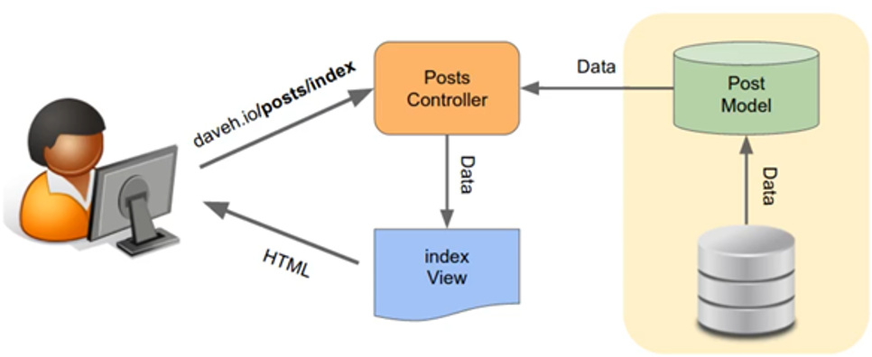

>[Torna a Controller](controller.md) 

## Controller che comunica con un modello DB

 

Tutti i modelli ereditano da una classe padre l’accesso al database che nelle **classi figlie** è recuperabile con la chiamata:
```PHP 
$db = static::getDB();
```

Esempio **completo** di controller che definisce alcune funzioni di gestione degli utenti prelevate da un DB:

```PHP
/*
* PHP version 5.4
*/
class Users extends \Core\Controller
{

    private $logged = false;
	/**
     * Before filter
     *
     * @return void
     */
    protected function before()
    {
		$logged = false;
		session_start();
		if (isset($_SESSION['username'])) {
			$logged = true;
		}else{
			//Redirect to login page
			View::renderTemplate('Login/login.html');
		}
		return $logged;
    }
    
    protected function after()
    {
        //echo " (after)";
    }

    // Action di un form
    // metodo HTTP POST FORM ACTION
    public function doOneuserAction()
    {
        if(isset($_GET['username'])){			 // Controlla se il form è stato sottomesso
    		$user = Login::test_input($_GET["username"]);
    		$row = User::getOneUser($user);
    		if(!empty($row)){
    		    $path = 'Users/oneuser.html';  // rendering con template Twig
                View::renderTemplate($path, [
                	'row' => $row
                  ]);  
    		}else{
    		     $path = 'Home/index'.$_SESSION['level'].'.html';
    		     View::renderTemplate($path);
    		}
        }
    }

    // richiesta pagina web
    public function allusersAction()
    {
	  $rows = User::getAllUsers();
	  
	  $path = 'Users/allusers.html';  // rendering con template Twig
	  View::renderTemplate($path, [
			'rows' => $rows
		  ]);  
	}
	
    // richiesta pagina di un form (metodo stub)
    public function oneuserAction()
    {
        $path = 'Users/oneuserform.html';
        View::renderTemplate($path);
	}
	
    // richiesta pagina web
    public function detailAction()
    {
	  $rows = User::getAll();
	  
	  $path = 'Users/alldetailed.html';  // rendering con template Twig
	  View::renderTemplate($path, [
			'rows' => $rows
		  ]);  
    }
}
```

Esempio di funzione del controller che **inserisce** una Pizza (record principale) e tutti i suoi ingredienti (lista di record secondari):
```PHP
public function doInseriscipizza()
{
	session_start();
	if($_SESSION['level'] == 0 || $_SESSION['level'] == 2) {
	    if(isset($_POST['Submit'])){// Controlla se il form è stato sottomesso
		$pizza = array();
		$pizza['Nome_pizza'] = Login::test_input($_POST['nome']);
		$pizza['Costo'] = Login::test_input($_POST['costo']);
		$pizza['PesoPizza'] = Login::test_input($_POST['peso']);
		$pizza['Adatta_Celiaci'] = (isset($_POST['celiaci'])) ? 1: 0;
		$pizza['Adatta_IntolleantiLattosio'] = (isset($_POST['lattosio'])) ? 1: 0;
		$pizza['Img'] = $target_file2;
		// inserimento record principale
		$id_pizza = Pizza::addPizza($pizza);   // l'id è generato da mysql
		if($id_pizza){ // se la pizza non è già in catalogo
		    $ing = "ingrediente";
		    $ingn = "ingrediente1";
		    $i = 1;
		    $ingredienti = array();
		    //print_r($_POST);
		    while(isset($_POST[$ingn]) && !empty($_POST[$ingn])){
			// generazione del record da inserire in una seconda tabella collegata alla prima
			$ingrediente = [
			    'Id_Ingrediente' => Login::test_input($_POST[$ingn]),       //campo value del select
			    'Quantita' => Login::test_input($_POST[$ingn."_quantita"])  //campo value dell'input
			];
			// inserimento del record secondario collegato mediante chiave esterna (associazione 1:N)
			Pizza::addIngredientePizza($id_pizza, $ingrediente);
			$i++;
			$ingn = $ing.$i;
		    }
		}
		$this->inseriscipizzaAction();
	    }
  	}
}
```
Esempio di funzione del controller che **inserisce** un oggeto JSON proveniente da un metodo POST:
```PHP
public function doInseriscimisura()
{
    $payload = file_get_contents('php://input');
    if(!empty($payload)){
	 $obj = json_decode($payload);
	 if($obj->token =="123456789") {
		Value::insMisura($obj);
		echo $payload;
	 }
    }
}
```

>[Torna a Controller](controller.md)
