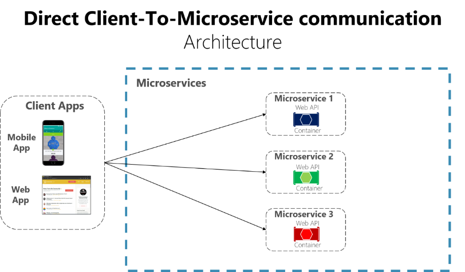
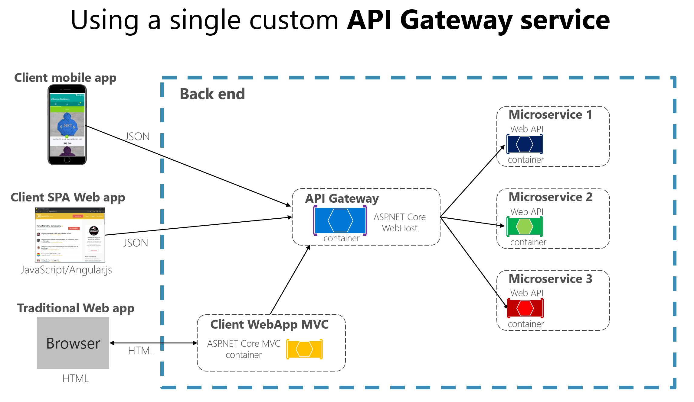

>[Torna all'indice generale](main.md)
## **MICROSERVIZI**

Microservizi: un'applicazione organizzata come una raccolta di servizi debolmente accoppiati tra loro (praticamente indipendenti). I servizi sono forniti da webservice che realizzano un set molto limitato di funzioni che possono essere realizzate in tempi molto brevi e che sono solitamente mantenute da un gruppo ristretto di persone (da 3 a 7). Essendo parte di una medesima applicazione in genere sono all’interno di uno stesso dominio DNS. 

Nell’ambito dei microservizi si sono affermate due architetture:
-	Direct to client
-	API gateway service

Un microservizio restituisce il risultato sotto forma di stringa JSON consegnata in genere con il protocollo http.

 
 

I servizi vengono aggregati sul client: 
-	la selezione delle informazioni provenienti dai vari JSON che la realizzazione del loro inserimento all’interno della pagina HTML avviene sul client.
-	Esiste il vincolo che i servizi devono provenire dallo stesso dominio per evitare attacchi XSS
-	Anche se si possono aggregare tutte, le informazioni che servono in genere sono poche.  Le altre informazioni devono comunque essere caricate determinando una maggior lentezza dell’applicazione.
-	E’ un approccio fat client che può fornire supporto soltanto ad applicazioni mobili o web di tipo SPA (Single Page Application)
 
 

L’aggregazione dei microservizi avviene sul server:
-	Il gateway fa da filtro e aggrega solo le informazioni che servono al client.
-	Possibilità di implementare server per client mobili o SPA (single Page Application) che risultano più veloci perché in questo caso al client arriva un’unica stringa JSON con il solo contenuto che serve.
-	Possibile anche l’architettura di tipo thin client tipica di una applicazione web tradizionale in cui tutto il contenuto della pagina viene costruito lato server e inviato in formato HTML. 
-	Possibilità di aggregare servizi provenienti da dominii differenti.

>[Torna all'indice generale](main.md)
