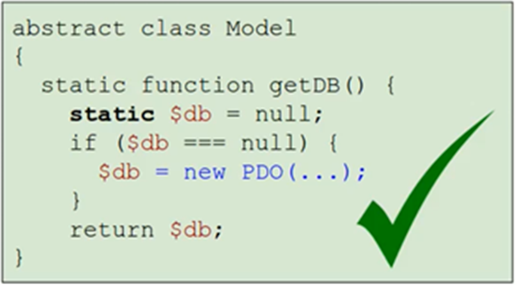

>[Torna a MVC](mvcindex.md) 
## **Model**

I modelli che consideriamo noi sono sostanzialmente due: 
-	**accesso al DB** per leggere o scrivere. Serve a recuperare, mediante una query SQL, quelle informazioni che devono essere organizzate in strutture PHP adatte ad una loro visualizzazione in una pagina o a alla composizione di una stringa JSON.
-	**accesso a web service** per filtraggio dei campi JSON e per la loro aggregazione in strutture PHP adatte ad una loro visualizzazione in una pagina o a alla composizione di una stringa JSON.
 



Occorre precisare che le classi del modello possiedono solo **metodi statici** che, in quanto tali, possono accedere soltanto a **proprietà statiche**. 

I metodi statici sono dichiarati anteponendo il qualificatore **static** davanti il nome del metodo, ad es:
```PHP
static function getHashedPsw($username,&$authlevel){
```
Le **proprietà statiche** sono dichiarate anteponendo il qualificatore ```static``` davanti il nome della proprietà:
```PHP 
private static $result = "";
```
Nonostante ciò le **classi statiche** possono restituire **oggetti dinamici**.

Infatti tutti modelli ereditano dalla classe padre l’**accesso all'oggetto database** che nelle **classi figlie** è recuperabile con la chiamata:

```PHP 
$db = static::getDB();
```
Inoltre, tutti i modelli ereditano dalla classe padre l’**accesso ad un oggetto client HTTP** che nelle **classi figlie** è recuperabile con la chiamata:

```PHP 
$rc = static::getRESTClient(); 
```

Gli oggetti restituiti, essendo **dinamici**, sono accessibili come al solito, mediante l'operatore -> avente davanti il **nome dell'oggetto**.
Ad esempio:

```PHP 
$result = $db->query($sql);
```
restituisce un array associativo risultato di una qyery SQL, mentre

```PHP 
$json = $rc->getJSONResponse();
```
restituisce una stringa JSON risultato di una richiesta HTTP.

Dal punto di vista organizzativo, conviene concentrare **la logica** dell'accesso alle **risorse** (database o webservice) **dentro il modello** organizzandola in un **set di funzioni** in grado di restituire tutti i dati necessari al controller per le sue elaborazioni (in genere la visualizzazione). Ogni **funzione** si occuperà di fare una **interrogazione** ben precisa, parametrica o meno, che restituisca un **singolo dato** oppure un **array associativo di dati** da utilizzare nel **controller**.,

Eventuali **eleborazioni sui dati**, ad esempio statistiche come il calcolo di una media, è bene che siano anch'esse svolte **nel modello**. Il modello è quindi il luogo deputato a:
- **recupero dei dati** dal **database** o dalla rete (**webservice**), filtrando le informazioni di interesse
- elaborazione della **logica applicativa** (ad esempio calcolo della contabilità)

La **rappresentazione** delle informazioni **nella vista** spesso ha una **struttura ad albero** dove ogni **nodo** dell'albero è un **oggetto** o un **array associativo**, che, oltre alle informazioni proprie di quel livello, contiene la **lista dei nodi** del livello ad esso **inferiore**. 

Ad esempio un catalogo di pizze può essere visto come una **lista** di pizze dove ogni pizza contiene la **lista** degli ingredienti in essa contenuti. La lista, sotto forma di **array associativo**, è proprio il modo con cui vengono restituite le righe (tuple) di una generica query.

Le **liste dei dati di un livello** si possono ottenere con una query che recupera tutti i nodi con una certa proprietà che li lega al **nodo padre**. Si potrebbero, ad esempio, recuperare tutte le pizze vegetariane.

**Per ogni nodo**, tutte le informazioni del **livello inferiore** si possono, di nuovo, recuperare con una seconda query che seleziona tutte quelle che posseggono una **proprietà** che le lega ad un **nodo padre**. Si potrebbero, ad esempio, recuperare tutti gli ingredienti di una certa pizza appartenente alla categoria delle pizze vegetariane. Se si vuole il catalogo delle pizze vegetariane, questa operazione va ripetuta per tutte le pizze della categoria.

**In sostanza**, per ottenere le informazioni sui nodi di un certo livello si deve:
1 **eseguire la query** che restituisce la lista dei nodi definendo come vincolo l'id dell'eventuale nodo padre comune 
2 **iterare sulla lista delle righe** restituite, inserirle nei campi di un oggetto o di un array associativo
3 **eseguire una seconda query**, utilizzando come chiave l'identificativo del nodo in esame, che ricava la lista delle informazioni correlate a quel nodo e salvarla in ulteriore campo dell'oggetto o dell'array associativo che corrisponde al nodo in esame.

Ad esempio con una query si può ricavare la lista delle pizze con le informazioni che ad esse appartengono come nome, costo e categoria. La lista può essere scandita con un ciclo che, letto l'id di ogni singola pizza, esegue al suo interno anche la query per recuperare la lista degli ingredienti corrispondenti a quell'id. Il risultato è un'altra lista che può essere iterata a sua volta, con un ciclo annidato a quello che recupera le singole pizze, per recuperare i singoli ingredienti che compongono la pizza corrente. 


**Esempi completi**

- [Modello per gestione accesso ad un DB](esmodeluser.md)
- [Modello per gestione accesso ad un webservice](eswebservice.md)

>[Torna a MVC](mvcindex.md) 
