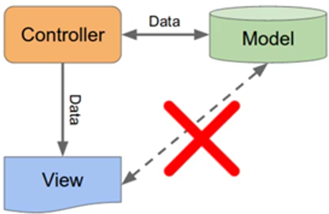

>[Torna all'indice generale](main.md)   
## **MODELLO MVC**

E’ un design pattern, cioè un modello architetturale adatto alla gestione di sistemi web complessi caratterizzato da un basso accoppiamento tra le sue componenti, circostanza che permette un interscambiabilità delle stesse. Ad esempio è possibile mantenere inalterati controller e modello e modificare la view adattandola a dispositivi mobili, web app SPA (Single Page Application), lingue diverse, ecc…
Una operazione analoga si può fare con il modello. Sia il modello che le view posseggono la proprietà di essere **riutilizzabili** da più controller contemporaneamente rendendo l’uso delle varie componenti molto flessibile.

Ogni componente possiede **responsabilità** specifiche:
-	**Controller**. Viene invocato alla ricezione di una chiamata http e, il suo codice, può invocare sia modello che view. Il **ciclo di vita** di una **richiesta** prevede in successione:
    1.	**acquisizione dei parametri** della richiesta http 
    2.	**accesso ai dati** del modello (in lettura o scrittura) utilizzando i **metodi** del modello ai quali si passano **come argomenti** i **parametri** della richiesta http
    3.	**accesso alla vista** per la **stampa del risultato**
-	**Modello**. Rappresenta un connettore del sistema MVC con una o più fonti dei dati. Tipicamente è il punto di accesso ad un database. Potrebbe anche essere il punto di accesso a servizi in rete esposti mediante webservice, in questo caso l’accesso è realizzato mediante un client http (curl).
-	**Vista**. Sono i contenuti che devono essere inviati al client web. A seconda del **modello di servizio** adottato è possibile inviare o dati grezzi in formato JSON, realizzando di fatto un webservice, oppure pagine HTML complete realizzate tutte o in parte sul lato server. La gestione può essere semplificata con l’adozione di un framework di templating che ha il beneficio di promuovere il **riuso** delle pagine web.

Ogni componente possiede **vincoli specifici**:
-	**Controller**. È l’unico componente che **parla con tutti** ed è l’unico che possiede il privilegio di poter **iniziare la comunicazione** con gli altri componenti.
-	**Modello**. Parla **solo se interrogato** dal controller e comunica solo con lui. Non può parlare con la vista.
-	**Vista**. Parla **solo se interrogato** dal controller e comunica solo con lui. Non può parlare con il modello.

Dopo avere esaminato il **ruolo** vediamo adesso il **funzionamento interno** dei vari componenti:

1. [Controller](controller.md) 
2. [Modello](model.md)
3. [Vista](view.md)
4. [Una metodologia di sviluppo](metodologia.md)

>[Torna all'indice generale](main.md)
