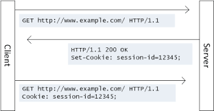
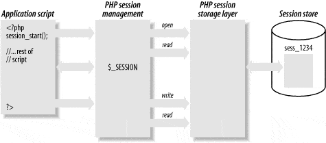
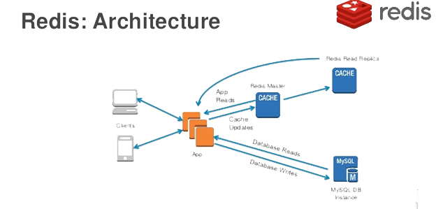
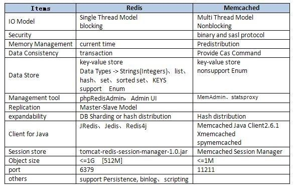

>[Torna a stato](state.md)

## **PAGINE WEB TRADIZIONALI** 

Le **pagine web tradizionali** si possono dividere in pagine **scorrelate** e pagine **correlate**. 
-	**Nelle prime** il servizio offerto dalla pagina è contenuto tutto al suo interno e pertanto non c’è motivo di caricare altre pagine oppure il caricamento delle pagine successive è del tutto indipendente da quello delle precedenti. La navigazione ha un comportamento stateless cioè senza stato. 
-	Nel **secondo caso**, pagine correlate, caricata la prima pagina, cioè una volta entrati nel sistema informatico, **l’accesso del client** viene in qualche modo **identificato, registrato** e successivamente **tracciato**. Il tracciamento si ottiene generalmente tramite **cookies** o, alternativamente, tramite **tokens**. Il **cookie** è un numeretto che **serve ad identificare univocamente il client tramite un clientID** ed è memorizzato **all’interno del browser** con cui accede alla risorsa. **Il clientID** è associato **allo stato dell'applicazione nell'accesso ad una risorsa** contenuta sul server.

**Ogni messaggio**, sia di richiesta che di risposta, sarà contrasseggnato con un ID di sessione che **identifica il client** presso il server.

**L’associazione** tra clientID e la risorsa può essere **memorizzata**:
1.	Sul **client**, in questo caso viene memorizzata **insieme al cookie** che identifica il browser dell’utente.
2.	Sul **server** dell’applicazione, in questo caso viene memorizzata **su un file** del modulo che genera le pagine lato server (PHP, Python, ecc.). Sono le **sessioni** propriamente dette.
3.	Sul **DBMS** all’interno delle tabelle che memorizzano i dati persistenti di una applicazione
4.	In **memoria RAM** su un **server di caching centralizzato** che di solito memorizza i dati di accesso di **molte applicazioni distribuite** su più server. I server **REDIS** e **MEMCACHED** sono le soluzioni di caching più diffuse. La consultazione dei dati di accesso si esegue in RAM per velocizzare gli accessi. La persistenza su disco viene eventualmente gestita per aumentare l’affidabilità.

Il **tracciamento** degli accessi non sempre ha una connotazione negativa. Esso è necessario per realizzare la gestione dello stato di una navigazione tra pagine che sono correlate in qualche modo, cioè la gestione della cosiddetta sessione di una **applicazione web** (client/server). 

Il nodo cruciale è la **privatezza** di queste informazioni.
Nella gestione delle **sessioni propriamente dette** essa è abbastanza elevata perché le associazioni tra clientID e risorse utilizzate sono su un file all’interno del server che crea le pagine web dinamiche e sono di norma direttamente accessibili solo da quelle pagine che accedono alla risorsa. Un accesso indiretto, da parte di altre pagine dinamiche, o da parte da altre applicazioni, comporta in qualche modo la **violazione** delle **misure di sicurezza** a protezione del **server**.

Nella gestione delle informazioni di navigazione (sessioni) **tramite cookies** le associazioni tra clientID e risorse utilizzate sono un file memorizzato all’interno del browser con cui si è acceduto ad esse. La privatezza in questo caso è quella del browser. Il browser di norma dovrebbe consentire la lettura dei cookies via codice client (ad es. javascript) solo da parte della pagina del client che accede la risorsa. L’accesso indiretto da parte di altre pagine, o da parte da altre applicazioni oltre il browser dovrebbe essere interdetto. Un accesso indiretto comporta in qualche modo la **violazione** delle **misure di sicurezza** a protezione del **client**.

Nella gestione delle informazioni di navigazione (sessioni) **tramite server di caching** come REDIS o MEMCACHED le associazioni tra clientID e risorse utilizzate sono memorizzate all’interno di un **server centralizzato** potenzialmente **comune** a moltissime applicazioni. L’accesso non è automaticamente compartimentato e la sicurezza dipende sia da **come** l’applicazione **memorizza** le associazioni sia da come è progettato **l’isolamento** complessivo del server (cifratura degli accessi, firewalls, privilegi, ecc.). Un accesso dei dati di un utente da parte di un altro utente è dovuto in qualche modo o alla **violazione** delle **misure di sicurezza** a protezione del **server** o ad una cattiva progettazione dello storage delle associazioni.
>[Torna a stato](state.md)
