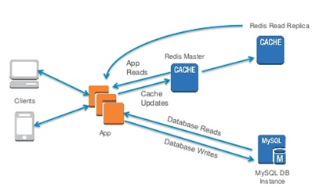

>[Torna a stato](state.md)

## **PAGINE WEB TRADIZIONALI** 

Le **pagine web tradizionali** si possono dividere in pagine **scorrelate** e pagine **correlate**. 
-	**Nelle prime** il servizio offerto dalla pagina è contenuto tutto al suo interno e pertanto non c’è motivo di caricare altre pagine oppure il caricamento delle pagine successive è del tutto indipendente da quello delle precedenti. La navigazione ha un comportamento stateless cioè senza stato. 
-	Nel **secondo caso**, pagine correlate, caricata la prima pagina, cioè una volta entrati nel sistema informatico, **l’accesso del client** viene in qualche modo **identificato, registrato** e successivamente **tracciato**. Il tracciamento si ottiene generalmente tramite **cookies** o, alternativamente, tramite **tokens**. Il **cookie** è un numeretto che **serve ad identificare univocamente il client tramite un clientID** ed è memorizzato **all’interno del browser** con cui accede alla risorsa. **Il clientID** è associato **allo stato dell'applicazione nell'accesso ad una risorsa** contenuta sul server. 

**Ogni messaggio**, sia di richiesta che di risposta, sarà contrasseggnato con un ID di sessione che **identifica il client** presso il server.

**L’associazione** tra clientID e la risorsa può essere **memorizzata**:
1.	Sul **client**, in questo caso viene memorizzata **insieme al cookie** che identifica il browser dell’utente. Ad esempio, con un comando **lato client** in javascript ciò può essere fatto con la funzione **window.localStorage**, con un comando **lato server** in PHP ciò può essere fatto con la funzione **setcookie()**.
2.	Sul **server** dell’applicazione, in questo caso viene memorizzata **su un file** del modulo che genera le pagine lato server (PHP, Python, ecc.). Sono le **sessioni** propriamente dette. **Il clientID**, analogo al bigliettino di un guaradaroa, è sempre memorizzato in un **cookie** sul browser del client. L'**autorizzazione**, con il **livello** associato a quell'iD, è invece memorizzata  in una **struttura dati sul server** in cui la **chiave di ricerca** è proprio il ClientID.

4.	Sul **DBMS** all’interno delle tabelle che memorizzano i dati persistenti di una applicazione
5.	In **memoria RAM** su un **server di caching centralizzato** che di solito memorizza i dati di accesso di **molte applicazioni distribuite** su più server. I server **REDIS** e **MEMCACHED** sono le soluzioni di caching più diffuse. La consultazione dei dati di accesso si esegue in RAM per velocizzare gli accessi. La persistenza su disco viene eventualmente gestita per aumentare l’affidabilità.
6.	Su **campi nascosti** di un form. E' una tecnica **stateless** nel senso che non è il server che memorizza l'**associazione ID Utente - risorsa**, piuttosto questa viene memorizzata **nel codice** stesso della pagina html sotto forma di valore (**proprietà value**) di input di una **casella di testo nascosta** (dichiarata hidden). Il **valore** arriva **hardcoded** nel codice HTML fino al client che, invece di mostrarlo all'utente (il campo è dichiarato hidden), alla pressione del pulsante submit, lo **reinvia** di nuovo al server insieme ai valori degli altri input che però sono visibili (non dichiarati hidden). Il server, ritrovando, nella richiesta http corrente, l'associazione assegnata preventivamente, **nella prima** richiesta che ha aperto la sessione, è in grado di servire correttamente il client. L'operazione può essere reiterata per tutte le richieste successive di una stessa navigazione.
7.	Mediante **riscrittura dell'url**. E' un metodo analogo a quello dei campi nascosti soltanndo che adesso il valore del sessionID viene inviato all'inizio dal server e poi palleggiato tra server e client all'interno dell'header dei pacchetti HTTP, in particolare nella zona riservata all'indirizzo url

**Confronto** REDIS vs MEMCACHED:

Il **tracciamento** degli accessi non sempre ha una connotazione negativa. Esso è necessario per realizzare la gestione dello **stato della navigazione** tra pagine che sono correlate in qualche modo, cioè la gestione della cosiddetta **sessione** di una **applicazione web** (client/server). 

Il nodo cruciale è la **privatezza** di queste informazioni.
Nella gestione delle **sessioni propriamente dette** essa è abbastanza elevata perché le associazioni tra clientID e risorse utilizzate sono su un file all’interno del server che crea le pagine web dinamiche e sono di norma direttamente accessibili solo da quelle pagine che accedono alla risorsa. Un accesso indiretto, da parte di altre pagine dinamiche, o da parte da altre applicazioni, comporta in qualche modo la **violazione** delle **misure di sicurezza** a protezione del **server**.

Nella gestione delle informazioni di navigazione (sessioni) **tramite cookies** le associazioni tra clientID e risorse utilizzate sono un file memorizzato all’interno del browser con cui si è acceduto ad esse. La privatezza in questo caso è quella del browser. Il browser di norma dovrebbe consentire la lettura dei cookies via codice client (ad es. javascript) solo da parte della pagina del client che accede la risorsa. L’accesso indiretto da parte di altre pagine, o da parte da altre applicazioni oltre il browser dovrebbe essere interdetto. Un accesso indiretto comporta in qualche modo la **violazione** delle **misure di sicurezza** a protezione del **client**.

Nella gestione delle informazioni di navigazione (sessioni) **tramite server di caching** come REDIS o MEMCACHED le associazioni tra clientID e risorse utilizzate sono memorizzate all’interno di un **server centralizzato** potenzialmente **comune** a moltissime applicazioni. L’accesso non è automaticamente compartimentato e la sicurezza dipende sia da **come** l’applicazione **memorizza** le associazioni sia da come è progettato **l’isolamento** complessivo del server (cifratura degli accessi, firewalls, privilegi, ecc.). Un accesso dei dati di un utente da parte di un altro utente è dovuto in qualche modo o alla **violazione** delle **misure di sicurezza** a protezione del **server** o ad una cattiva progettazione dello storage delle associazioni.

Un utilizzo comune dei **servizi di caching** avviene in tutte quelle situazioni in cui **richieste successive** legate ad una **stessa sessione** potrebbero essere servite da **mecchine diverse**. 

Ciò può accadere durante una **stessa sessione** di navigazione perchè:
- servizi ed informazioni sono **frammentati su più server** 
- i servizi potrebbero essere **replicati su un pool di macchine** dietro un **bilanciatore di carico** che seleziona la macchina che, in un certo istante, è **più scarica**.

## **Sicurezza delle varie tecniche**

Occorre rimarcare che, **in generale**, gestire una **autorizzazione** rilasciata dal server per accedere ad una risorsa da lui offerta usando una **soluzione memorizzata sul client** quale, ad esempio, i **localstorage** o i **campi hidden** non ha lo stesso **livello di sicurezza** delle **sessioni** o di una qualsivoglia **memorizzazione sul server** (tipo redis o memcached). 

Il **server** può essere protetto **direttamente dall'azienda** con un livello di protezione scalabile a piacimento e **commisurato** all'importanza delle autorizzazioni concesse. Un **browser aggiornato** garantisce un livello di isolamento dei dati elevato ma è un luogo comunque **esterno** al perimetro aziendale. 

Un possibile **problema di sicurezza** potrebbe consistere nella **modifica o la falsificazione** di una autorizzazione memorizzata sul client. Una **possibile soluzione** potrebbe essere salvare l'autorizzazione sul client sotto forma di **ticket**, ossia una informazione **firmata o cifrata dal server**: al momento della richiesta di accesso alla risorsa da parte del client (mediante un webservice), il server **controlla la firma** e, se la riconosce, autorizza l'accesso alla risorsa. 

**Ad esempio**, Nonostante l'elaborazione di un dato cifrato sul client sia **più onerosa** in termini di velocità a quella di un dato in chiaro sul server,  questa è comunque la strategia adottata dal protocollo di autenticazione per webservice **JWT**.

>[Torna a stato](state.md)
