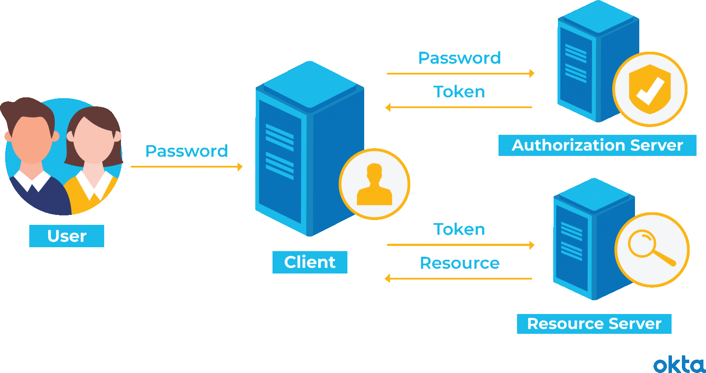

## ** GESTIONE TRAMITE TOKEN**

Il tracciamento degli accessi dell’utente può essere realizzato tramite un token di accesso che viene generato al momento della registrazione dell’utente. Il token viene generato su un server di autenticazione che, dopo aver riconosciuto (autenticato) l’utente, lo autorizza all’accesso di determinate risorse. Ogni volta che il client vuole accedere alle risorse autorizzate esibisce il token.
Il token può essere memorizzato:
1.	Sul client sotto forma di ticket (associazione utente-risorsa firmato dal server)
2.	Sul DBMS all’interno delle tabelle che memorizzano i dati persistenti di una applicazione
3.	Su un server di AAA
4.	
 
 
Per aumentare la sicurezza il token può essere cifrato o firmato mediante crittografia asimmetrica. Un protocollo molto adoperato per la gestione stateless della navigazione tra le risorse web è il JSON Web Token (JWT).
